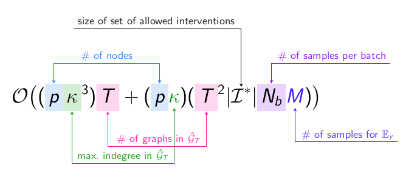
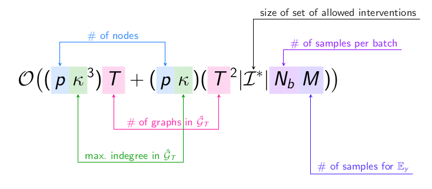

# Annotate equations in LaTeX using TikZ

## A package with reusable commands



Using [`annotate_equations.sty`](https://github.com/st--/annotate-equations/blob/main/annotate_equations.sty), an equation can easily be annotated as follows:
```latex
\begin{equation*}
    \mathcal{O}\big(
        (
        \eqnmarkbox[NavyBlue]{p1}{p}
        \eqnmarkbox[OliveGreen]{k1}{\kappa}^3  % note that we have the ^3 outside the \eqnmark/\tikzmarknode arguments
        )
        \eqnmarkbox[WildStrawberry]{T1}{T}
        +
        (
        \eqnmarkbox[NavyBlue]{p2}{p}  % tikz nodes need distinct names!
        \eqnmark[OliveGreen]{k2}{\kappa}
        )
        (
        \eqnmarkbox[WildStrawberry]{T2}{T}^2
        \tikzmarknode{Is}{|\mathcal{I}^*|}  % manual \tikzmarknode works, too
        \eqnmarkbox[Plum]{Nb}{N_b}
        \eqnmark[RoyalPurple]{M}{M}
        )
    \big)
\end{equation*}
\annotatetwo[yshift=1em]{above}{p1}{p2}{\# of nodes}
\annotatetwo[yshift=-1em,xshift=0.2ex]{below}{T1}{T2}{\# of graphs in $\hat{\mathcal{G}}_T$}
\annotatetwo[yshift=-2em]{below}{k1}{k2}{max.\ indegree in $\hat{\mathcal{G}}_T$}
\annotate[yshift=3em]{above,left}{Is}{size of set of allowed interventions}
\annotate[yshift=1em]{above}{Nb}{\# of samples per batch}
\annotate[yshift=-1em]{below}{M}{\# of samples for $\mathbb{E}_y$}
```

More details are in the [user manual](annotate-equations.pdf).
Should work with both pdflatex and lualatex.

## How to do it from scratch: annotated examples


Inspired by Sibin Mohan's https://github.com/synercys/annotated_latex_equations/, but with significantly simplified TikZ code, and with lots of comments to explain what is going on.

Two versions, one [as Beamer slides with transitions](https://github.com/st--/annotate-equations/blob/main/examples/demo_manual_annotate_beamer.tex), one [as an article](https://github.com/st--/annotate-equations/blob/main/examples/demo_manual_annotate_article.tex). For further examples, see https://github.com/synercys/annotated_latex_equations/.

### Giving all highlight boxes the same height

Simply add a `\mathstrut` within the colorbox:
```diff
-\newcommand{\highlight}[2]{\colorbox{#1!17}{$#2$}}
+\newcommand{\highlight}[2]{\colorbox{#1!17}{$\mathstrut #2$}}
```



## Much more information...

...in the answers to [this TeX StackExchange question](https://tex.stackexchange.com/q/254844/171664).
